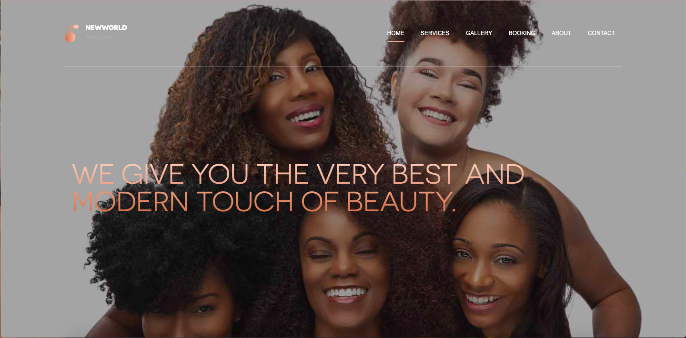
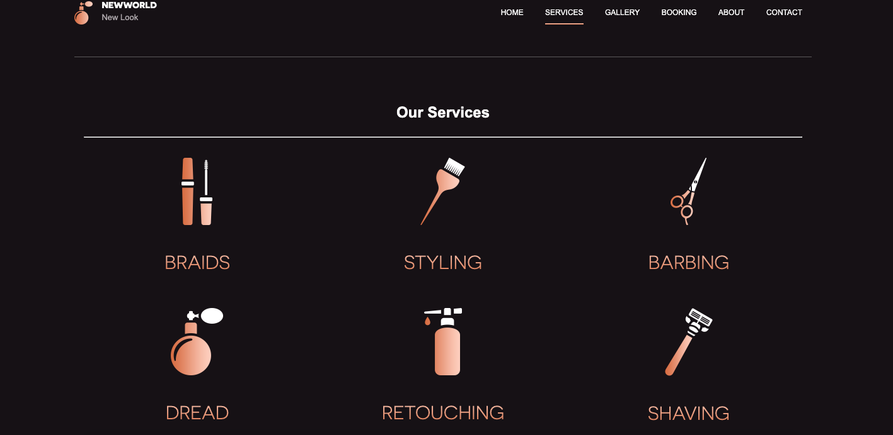
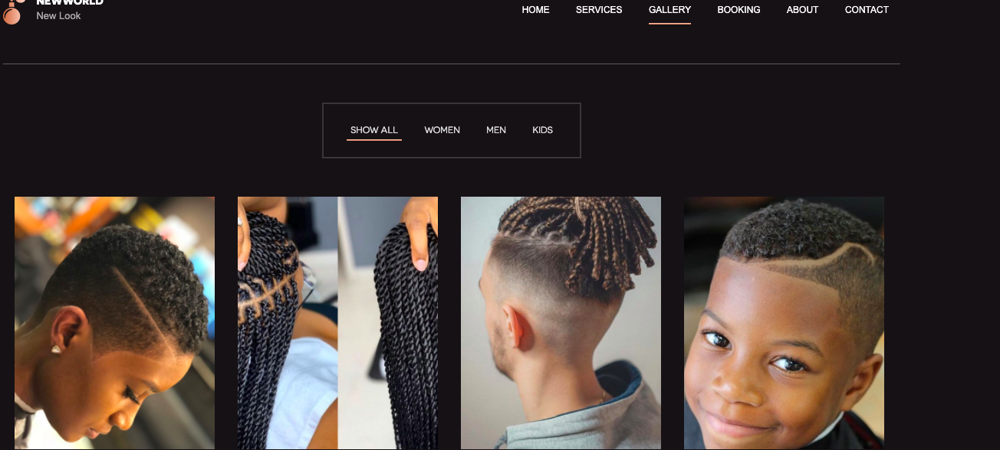
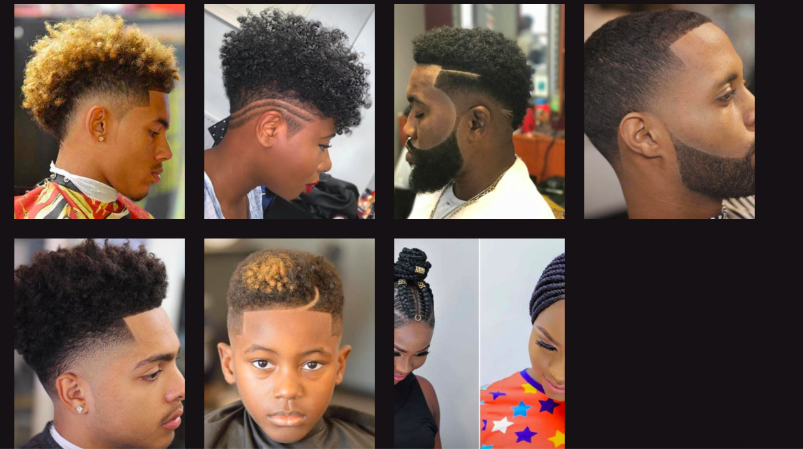
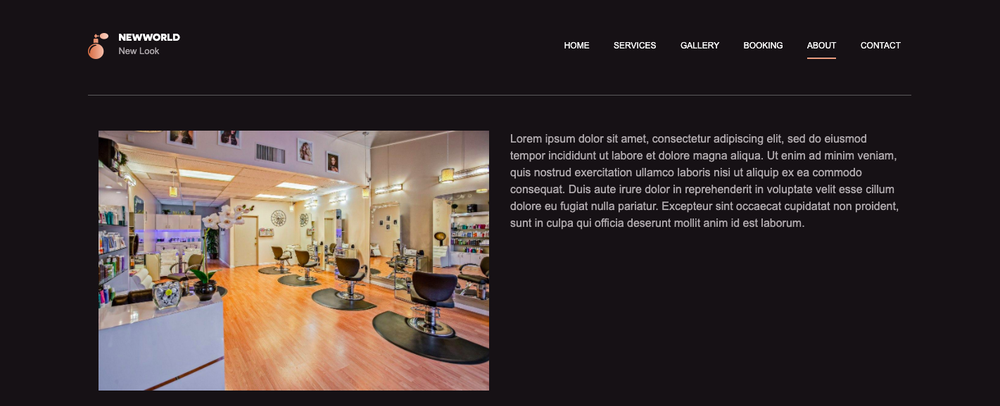
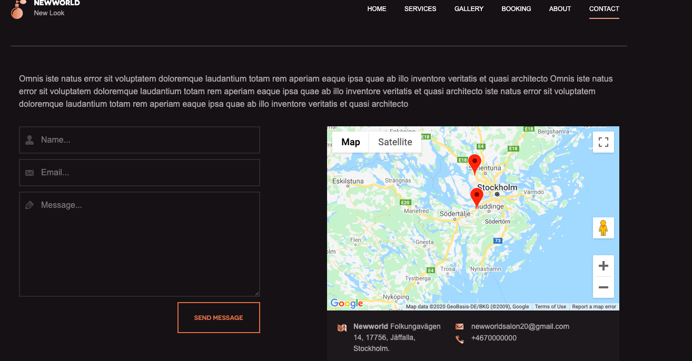
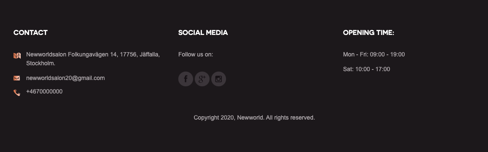

# Second Milestone Project Newworldsalon

**Project's Name – Newworldsalon**

Newworldsalon is a personal real-life project that I intend to start-up by December 2020. It is a beauty shop located in the heart of Stockholm. The goal is to redefine the outer beauty that brings out the inner beauty in our clients by meeting the needs of people. A place were men, women and children can have a fresh hair cut and styles. The salon provides different services that could help satisfy clients beauty and looks. 

**A brief project method:**

As mentioned earlier the aim of the project is to help promote cleanliness, healthy and smart look. Looking refreshed attracts good companies. My passion is driven from my love for hair, make-up, looking clean and good. As the saying goes “Cleanliness is next to godliness”. Also is my passion to see people looking nice and presentable for work, meetings and  social life. I feel starting up a salon will give me a platform help contribute to healthy living and longer life span. 

After going through my first milestone project and JS, I have gathered some knowledge on how to design a simple website like this. I have also watched lots of tutorials and got the section designs from looking at different Salon website sites. Further details about the project are given below.  

# User Experience process:

This project is designed for everyone, young, old, female or male irrespective of their ages. The aim of the is to promote and encourage a healthy lifestyle by meeting the needs of people. Having a good haircut and hairdo compliments to the nice outfit of the occasion. There are professional hair stylist with long years of experience avaliable to give clients the best shaves and styles.

There are several benefit attached to being a member and client of our salon ranging from proffessional advice on:

•	How to grow healthy hair.

•	How to stop hair breakage.

•	How to avoid having rashes and bumps etc.  

•	We listen to our clients and give them exactly what they want.   

•	We provide the use of modern equipment for our services to ensure full comfort and satisfaction to our clients. 

•	There are two locations for client’s flexibility and access same quality and same standards applicable.

•	There are possibilities to book online.

## Visitor Goals:

The main target audience for "Newworldsalon" is basically everyone leaving in Stockholm as well as visitors who come around on tourist. We all grow hair which is part of our nature and it is only normal to want to look good to all our pressing commitments like work. It is also expedient that we look fresh and presentable at all times hence having a clean hair shave twice in a week is highly recommended. People who are interested in living a healthy life style.
   

**User goals includes:**

-	Online booking

-	Pricelist

-	Address of location

-	Google map

-	Contact numbers

-	Social media accounts

-	Satisfaction

-	Self confidence

-	Opportunity to meet new people

-	Self-awareness

-	New look

-	Access to free professional advice

-	Drop In

-	Certified Professionals

-	Discounted Products for members

***These needs can be meet because:*** The website have been carefully designed to provide all the neccessary information required by the user and easy to find. 

# User Stories:

-   As a visitor to Newworldsalon website I expect/want/need:

-	To easily find the information they are looking for. 

-	The information is presented a way the user can easily understand. 

-	There is no too much information that coild mislead the user. 

-	The site can be easily navigated and responsive from any device, desktop, tablet or phone. 

-	To learn more about the gym and their services. In order to have a clear picture.

-	To display all information and images clearly and easy to understand manner irrespective of the size of screen.

-	To be able to book online for services.

-	To be able to interact with the professionals and get feedbacks. 

# Features:

**Navbar:** The navbar is designed to give the users a quick access to the different informations that has been provided to assist them. Such as: Home, Gallery, About section, Services provided, Booking sections and the contact Us.

**Home:** The homepage consists of three slides displaying pictures of different people with different hair textures and hair looks. It also displays an overlay of what we offer.

**Services:** This section consists of two parts the main services rendered and the pricelist for both men and women. It is designed to show the users some examples of different hair services we offer and help them get their desired look. 

**Gallery:** This section is designed to to reassure the user that they are making the right choice to come to us. Pictures of samples of haircuts and styles are displayed to showcase examples of work previously done. To build clients confidence. This way we can build the trust 
of our clients even before they finally become our members. 

**Booking:** This section allows the client to make a booking for an appiontment. The first step is to register and become a member in the salon. From the next time it becomes more easy to book for subsequent appiontment with the already created username and password. These can also be retrieved when forgotten. Customers would receive confirmation messages in their emails.

**About:**  This section is to provide the users with more nformation about the salon. Its aim and why they should choose to style their hair at Newworld.

**Contact:** This section is very important and is designed to enable users contact us. The map shows the pointers to the two different branches in Stockholm. They can as well share their thoughts on any matter and ask for more informations. They can also give feedbacks.

***More on the Contact page:***

1. The contact page contains a form for the user to fill in to send the salon an email address.

2. Name, email address and message are all required fields so that the shop owner receives all the information she needs to respond.

3. If the user has logged in, then their email address will be registered in the email field.

4. When the user clicks "send" the email is processed and sent via email to The Newworldsalon's email address.
          

**Footer:** The footer section is designed to create an opportunity for easy interaction with users through our various soacial media links, show a quick display of our location contact number and most importantly the opening time of the salon.     

# Another future idea:

•	Password reset by email: gmail setting required when/if site is finally deployed to be in use which is not relevant now. 

•	In the home section I hope to have a link to quickly make a booking.

•	To also add more information in the home section and more pictures to the gallery

•	To add the opening time in the About section

# Contents:

Contents were written and gotten from google search, Wikipedia and personal thoughts and experience. 

**Languages:** This project uses HTML5, CSS4, JS, JQuery programming languages.

    
# Technologies used:

-	Git to handle version control.

-	GitHub to store and share all project code remotely.

-	Gitpod to create workspaces.

-	The project uses Boothstrap CDN, Font awesome and Icons links. 

-	Bootsstrap templates was used in the project. Bootsstrap will ensure mobile-first responsiveness. 

## Colours: 
 Main colours used were black and white. To give a unique and attractive look. 

## Icons: 
Were used to have a visual knowledge of what is expected or expressed. links where gotten from font awesome icons website.  

**Libraries and tools:** Have been used to construct this project includes: 

**Deployment of Peace Fitness website to GitHub:**

How to run this project locally

- To run this project on your own IDE :

- Ensure you have the tool GITPOD ONLINE IDE 

- Ensure to have a registered gitpod account inorderto access all functionalities on the site locally

                        

***Below is the step I followed to deploy my site to GitHub.***
                        

- I typed all these command listed below on the terminal and pushed the code to the repository file that was created for the project on GitHub. 

-  git init

-  git status

-  git add .

-  git commit -m "first commit" .

-  git status

-  git push
                     
To *************

**Testing:**
   
   This responsive and adapts to all sizes. The links on the navbar to the the sections have been tested and funtions well.
   Every link takes you to the right sections. The home page keeps the user on the first section since it is the homepage. Though I am aware the homepage on the navbar could be deleted since it takes the user no 
   where other than the first page that could be seen already. The reason why is there is to let them know that is the Homepage. Every sections have been tested to ensure they all work well as intended.

   The pictures displays clearly and fine on the different sections. 
   All links used for icons and buttons are tested to function well for the user experirnce to be achieved. Every details have been provided to give the user a straightforward
   guidance towards achieving their goals. 
   
   These test have been done manually by me checking them out on the external website to ensure results are shown as expected. 
   - The Html test code - code was ran on the html testing site through W3C markup validation service website - https://validator.w3.org/,
   - Html viewer code beautify - https://codebeautify.org/htmlviewer/, 

# Credits
**References of pictures that have been used as well as tutorials and researches for codes.** 

***https://www.youtube.com/watch?v=9CY0V0JAgNU&list=PLYsknCZ8zCFrQek2D4jqfwQpraPRktCb_&index=6&t=0s***

***https://www.youtube.com/watch?v=AiaEqc9UMf8&list=PLYsknCZ8zCFrQek2D4jqfwQpraPRktCb_&index=4&t=1654s***

***https://www.youtube.com/user/TechGuyWeb***

***https://www.youtube.com/watch?v=sQmlMhwOJoc&list=PLYsknCZ8zCFoDzJj3L3-n71s57E0ktX-w&index=7&t=0s***

***Pic salon Photo by Delbeautybox from Pexels***

***https://www.google.com/search?q=men+braid+hairstyles+2020&tbm=isch&ved=2ahUKEwiZlsGNgqXrAhVMr6QKHTxdC8IQ2-cCegQIABAA&oq=men+braid+hair&gs_lcp=CgNpbWcQARgCMgIIADICCAAyAggAMgIIADICCAAyAggAMgIIADICCAAyAggAOgYIABAHEB5Q8c0KWNHSCmDu-ApoAHAAeACAAVWIAaEBkgEBMpgBAKABAaoBC2d3cy13aXotaW1nwAEB&sclient=img&ei=x-w7X9mWA8zekgW8uq2QDA&bih=663&biw=1421&hl=en&hl=en#imgrc=y01qhNvcXskl3M&imgdii=HsZmadvoIWWDIM***

***https://www.google.com/search?q=afrowemen+short+hair+&tbm=isch&ved=2ahUKEwic_euxh6XrAhUTuKQKHehnBYkQ2-cCegQIABAA&oq=afrowemen+short+hair+&gs_lcp=CgNpbWcQAzoICAAQCBAHEB46BggAEAgQHjoCCAA6BggAEAcQHlDXiSxYwZstYI2jLWgDcAB4AIABpQGIAYoSkgEEMjUuNJgBAKABAaoBC2d3cy13aXotaW1nwAEB&sclient=img&ei=UfI7X9yQGpPwkgXoz5XICA&bih=663&biw=1421&hl=en&hl=en#imgrc=hJfxJit8Ez5M8M&imgdii=Oi7U_SHHko1cmM***

***https://www.google.com/search?q=afro+american+hair+braids&tbm=isch&ved=2ahUKEwjrk73jgqXrAhVZO-wKHX7dAMYQ2-cCegQIABAA&oq&gs_lcp=CgNpbWcQARgGMgcIIxDqAhAnMgcIIxDqAhAnMgcIIxDqAhAnMgcIIxDqAhAnMgcIIxDqAhAnMgcIIxDqAhAnMgcIIxDqAhAnMgcIIxDqAhAnMgcIIxDqAhAnMgcIIxDqAhAnOgIIADoGCAAQBRAeOgYIABAIEB46BAgjECc6BAgAEB46BAgAEEM6BQgAELEDUMXtSljliEtg6L1LaAFwAHgAgAG-AYgBiw-SAQQyMS4zmAEAoAEBqgELZ3dzLXdpei1pbWewAQrAAQE&sclient=img&ei=e-07X6vqFNn2sAf-uoOwDA&bih=663&biw=1421&hl=en&hl=en#imgrc=zIgCCFIZk_EOaM***

***Image by <a href="https://pixabay.com/users/StockSnap-894430/?utm_source=link-attribution&amp;utm_medium=referral&amp;utm_campaign=image&amp;utm_content=2561845">StockSnap</a> from <a href="https://pixabay.com/?utm_source=link-attribution&amp;utm_medium=referral&amp;utm_campaign=image&amp;utm_content=2561845">Pixabay</a>
Image by StockSnap from Pixabay***

# Acknowledgements:
I would like to say a special thank you to my mentor Gerard McBride, the student care support, Tutor Assistance, slack community and others for their tremendous support during the time 
of developing this project.
           
I received inspiration for this project from my love for hair and beauty. 

Feel free to contact me through my email - zappy4chat@yahoo.com

